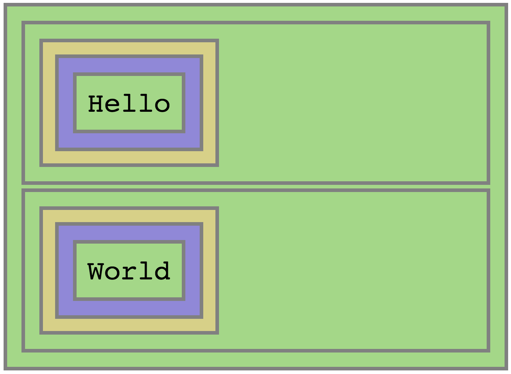

# Events Delegation Interactive Repo

## Step 1 - Basic HTML

We start by building a basic DOM structure which consists of several divs, tables and cells.

Let's add DOM events.  
We want to add click events to each of the `"Hello"` and `"World"` elements. When we click `"Hello"` we should hear one beep, and when we click `"World"` we should hear 2 beeps.

__Continue to [step-2](../../treestep-2).__
