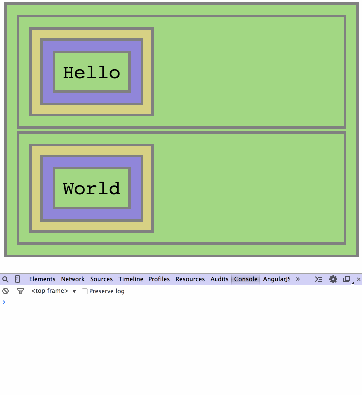

# Events Delegation Interactive Repo

## Step 12 - A Generic Event Delegation Framework

We have reached the final step of this guide.

All that is left is to implement a global event handling function for a root DOM element. This function is called every time an event is triggered on this element. It needs to:

0. Examine the target of the event (on which of the child elements the event occured).
0. Go through each of the selectors of delegated event handlers.
0. If the selector matches the target element, call the respective handler.

```Javascript
// ...

// generate a global handler function
// for the root element 'el'.
var self = this;
function gHandler(root){

    // return an event handling function
    return function(event){

        var target = event.target,
            handlers = self.eventHandlers[type],
            i, j, selector, handler, els;

        for (i = 0; i < handlers.length; i++){

            selector = handlers[i].selector;
            handler = handlers[i].handler;

            // get all the child elements which match the
            // current selector
            els = root.querySelectorAll(selector);

            // check if one of them matches the target element
            for (j = 0; j < els.length; j++){
                // if a match is found, call the respective handler
                if (els[j] === target){
                    handler(event);
                    break;
                }
            }

        }

    };

}
```

Now our framework is complete. Let's try to use it to delegate events:

```Javascript
var foo = $("#foo"),
    bar = $("#bar");

foo.on('click', 'div.hello', helloOnClick);
bar.on('click', 'div.world', worldOnClick);
```



And it works.

__Continue to [summary](../../tree/summary).__
