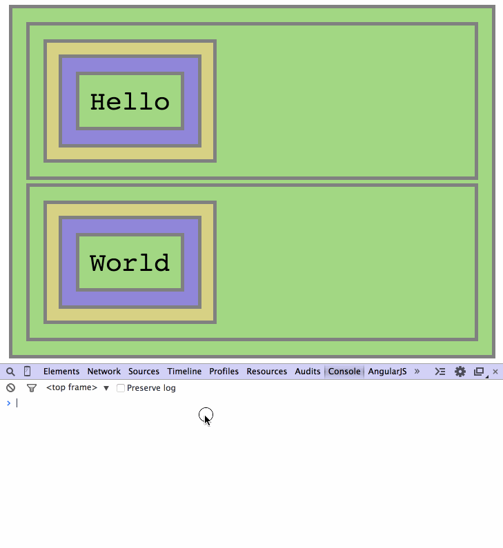

# Events Delegation Interactive Repo

## Step 6 - Delegating events to the parent and filtering the target

We only want the `"Hello"` and `"World"` divs to beep on clicks, and not any other element inside `#foo` and `#bar`.

Let's modify our event handlers to examine the target of the click event, and play the beep only for the desired target.

```Javascript
function helloOnClick(e){ 
    if (e.target.matches("div#foo div.hello")){
        beep();
    }
}

function worldOnClick(e) {
    if (e.target.matches("div#bar div.world")){
        beep();
        setTimeout(beep, 200);
    }
}
```

`"div#foo div.hello"` tells our `helloOnClick` handler to beep only when the target is a DIV element with a `".hello"` class inside the `#foo` container. Similarly the `worldOnClick` handler will beep only when the target is a DIV element with a `".world"` class inside the `#bar` container.



Although now we get what we want, this solution is not very scalable. What if we add other types of elements into our `#foo` and `#bar` containers with different events? Then we would have to check the target of the event for each of those types. Again, this is a lot of manual work.

In the next steps we will see how we can build a more generic event delegation solution.

__Continue to [step-7](../../tree/step-7).__
