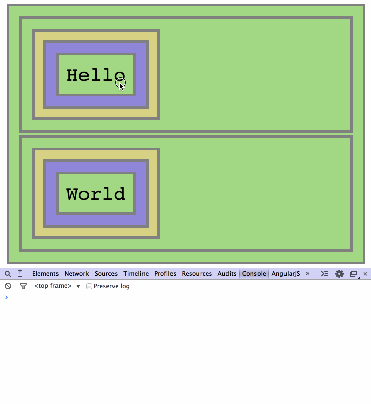

# Events Delegation Interactive Repo

## Step 4 - Manually Adding DOM Elements and Adding Events

We modify the `addHelloDiv` function to also add a click event to the new
DOM element:

```Javascript
function addHelloDiv(){
    var fooTr = document.querySelectorAll("div#foo table tr")[0],
        td = document.createElement("td"),
        div = document.createElement("div");

    div.innerHTML = "Hello";
    td.appendChild(div);
    fooTr.appendChild(td);

    div.addEventListener('click', helloOnClick);
}
```



And indeed, now clicking the new element works, as expected.

We can stop here, and use this method of manually adding events to our elements. We need to remember to add an event every time we add a new element (as well as removing events when we remove elements, using `element.removeEventListener( ... )`).

Managing events for each element in our page is a hassle. If we have thousands of elements, we need to add thousands of events, and manage their lifetime together with the lifetime of the elements.

In the next few steps we will see a different, easier, approach.

__Continue to [step-5](./step-5).__
