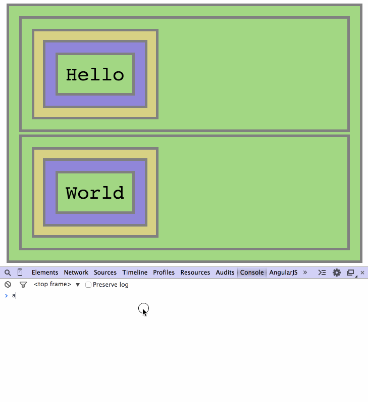

# Events Delegation Interactive Repo

## Step 3 - Manually Adding DOM Elements

Let's write a function to manually add a new `"Hello"` DIV element:

```Javascript
function addHelloDiv(){
    var fooTr = document.querySelectorAll("div#foo table tr")[0],
        td = document.createElement("td"),
        div = document.createElement("div");

    div.innerHTML = "Hello";
    td.appendChild(div);
    fooTr.appendChild(td);
}
```



We see that, although the new element is successfully added, nothing happens when we click it. This makes sense, as we didn't add any event to the new element. Let's do it in the next step.

__Continue to [step-4](./step-4).__
