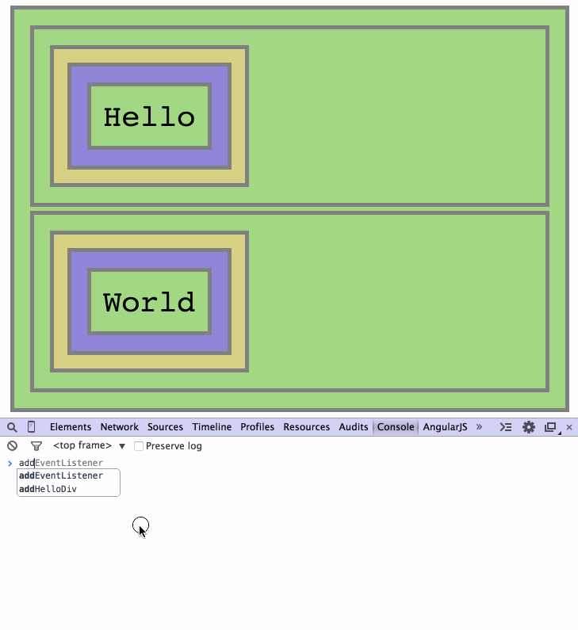

# Events Delegation Interactive Repo

## Step 5 - Delegating events to the parent

In this step we will have the first attempt with event delegation.

We want to avoid the hassle of managing events for each element separately.
One easy solution would be to just add the event to the parent element:

```Javascript
var foo = document.getElementById("foo"),
    bar = document.getElementById("bar");

foo.addEventListener('click', helloOnClick);
foo.addEventListener('click', worldOnClick);
```

Now every time we click inside one of the parent divs, `#foo` and `#bar`,
we will hear beeps.



But this is not exactly what we want. We want only the `"Hello"` and `"World"`
divs to respond to clicks, and not all the elements inside `#foo` and `#bar`.

In the next step we will propose a naive way to make this distinction.

__Continue to [step-6](../../tree/step-6).__
